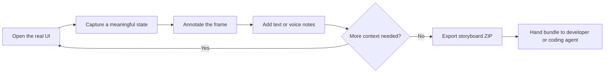
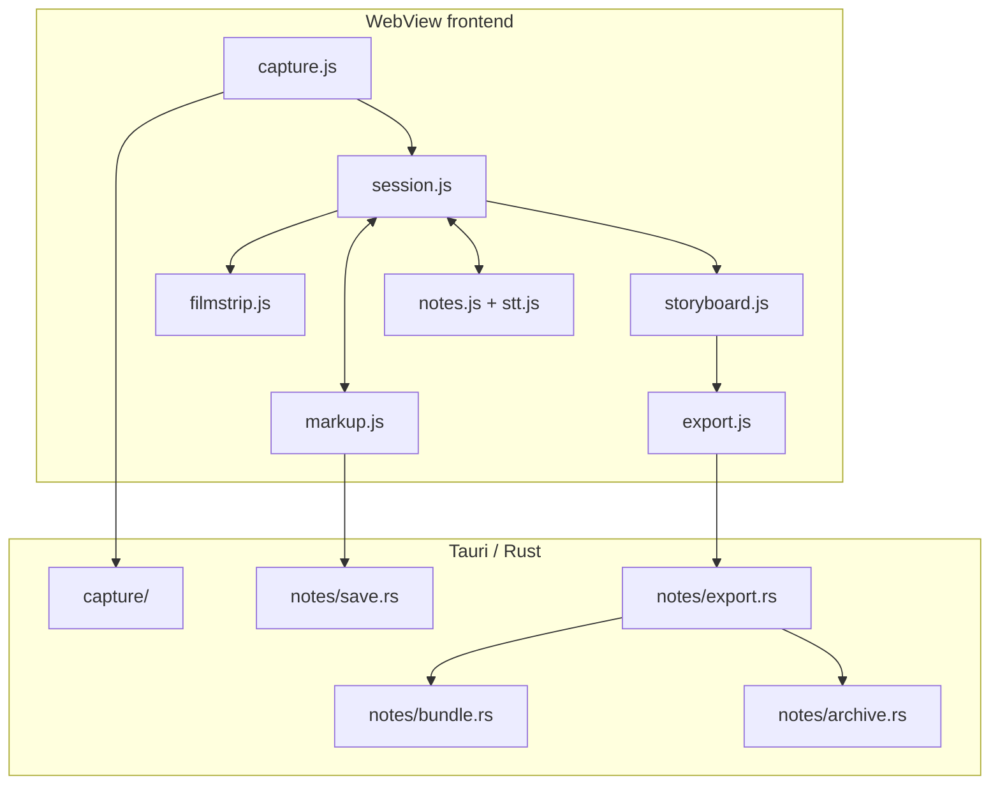

# CritIQ

> Capture the story of a UI, not just a screenshot.

CritIQ is a lightweight desktop storyboard capture tool for AI-assisted UI development. It lets a user navigate a real interface, capture successive states, annotate each frame, attach notes, and export the ordered session as one portable evidence bundle.

The user controls what becomes evidence. The developer or coding agent receives the complete story at once.

## Mission

**CritIQ turns a live UI walkthrough into a precise, ordered, annotated record of actual application state that a developer or coding agent can act on without repeatedly asking for screenshots or taking over the browser.**

CritIQ closes a specific gap in AI-assisted UI work:

- A single screenshot lacks sequence and context.
- A pile of screenshots is laborious to create, organize, and explain.
- Giving an agent browser control reduces the user's control over what gets observed and emphasized.
- Design tools describe intended state, while CritIQ captures runtime state.

## Core workflow



A CritIQ session is an ordered storyboard. Each frame preserves its screenshot, visible annotations, notes, timestamp, and capture metadata.

## Current v1 scope

CritIQ uses:

- Tauri 2 for the desktop shell.
- Rust for capture and filesystem export.
- Vanilla JavaScript for the WebView frontend.
- Web Speech when supported by the platform WebView for optional voice notes.
- Local filesystem storage only.

The v1 workflow includes:

- full-screen, multi-screen, and region capture;
- ordered filmstrip navigation;
- pen, arrow, rectangle, and text markup;
- frame-local text and voice notes;
- durable frame state across navigation;
- annotated storyboard export;
- deterministic `manifest.json` and `storyboard.md` generation;
- a real ZIP handoff artifact.

## Storyboard artifact

The recommended export is one ZIP archive:

```text
critiq-session-<id>.zip
├── storyboard.md
├── manifest.json
└── frames/
    ├── 001.png
    ├── 002.png
    └── 003.png
```

Every image in `frames/` is the composited annotated frame the user reviewed in CritIQ, rather than the untouched source capture.

`storyboard.md` provides the human-readable sequence. `manifest.json` provides deterministic machine-readable context using the `critiq.storyboard/v1` schema.

## Architecture



The architecture deliberately has no application server, database, account system, cloud sync, browser automation, or embedded AI inference.

## Explicit non-goals

CritIQ v1 is not:

- a general-purpose image editor;
- a screen recorder or video editor;
- a browser automation agent;
- a design-system or Figma replacement;
- a cloud collaboration platform;
- an AI coding agent;
- a plugin platform.

## Development

### Prerequisites

- Node.js 22 or compatible current LTS
- npm
- Rust stable toolchain
- Tauri 2 platform prerequisites

### Run locally

```bash
npm ci
npm run dev
```

### Validate

```bash
npm test -- --run
cargo check --manifest-path src-tauri/Cargo.toml
cargo test --manifest-path src-tauri/Cargo.toml
```

### Build

```bash
npm run build
```

The repository CI runs the same validation plus a Windows Tauri production build.

## Acceptance target

CritIQ v1 is ready when a three-frame walkthrough can be captured, independently annotated and noted, navigated without state loss, exported as a ZIP, unpacked outside CritIQ, and understood in the original sequence.

See [`docs/ONE_DAY_EVOLUTION.md`](docs/ONE_DAY_EVOLUTION.md) for the bounded implementation and acceptance plan, and [`docs/ARCHITECTURE_PLAN.md`](docs/ARCHITECTURE_PLAN.md) for the current architecture contract.

## License

MIT. See [`LICENSE`](LICENSE).
