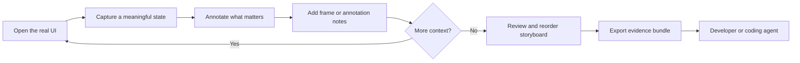
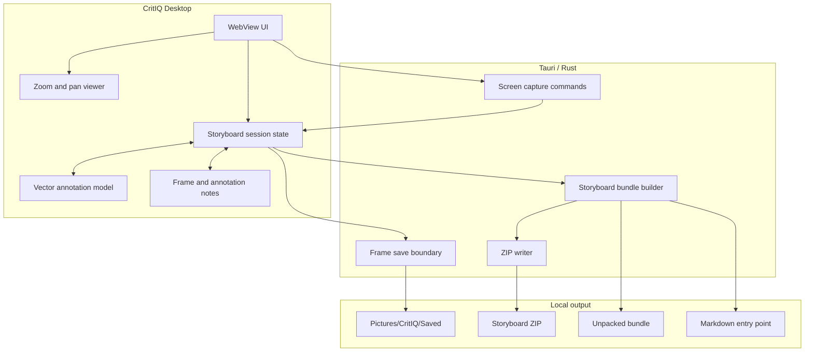

<p align="center">
  
</p>

<div align="center">

# CritIQ

### Capture the story of a UI, not just a screenshot.

**A local-first desktop storyboard tool for user-directed UI evidence in AI-assisted software development.**

[](https://github.com/MythologIQ-Labs-LLC/CritIQ/actions/workflows/ci.yml)
[](https://github.com/MythologIQ-Labs-LLC/CritIQ/releases)


[](LICENSE)

**[Install](#install)** · **[Features](#feature-map)** · **[Architecture](#architecture)** · **[Documentation](docs/README.md)** · **[Governance](GOVERNANCE.md)** · **[Contributing](CONTRIBUTING.md)** · **[Security](SECURITY.md)** · **[Support](SUPPORT.md)**

</div>

---

> [!IMPORTANT]
> **Current maturity:** CritIQ is in release-candidate validation. CI proves the declared automated contracts and Windows production build. Final release status requires the desktop acceptance procedure in [`docs/ACCEPTANCE_TEST.md`](docs/ACCEPTANCE_TEST.md). Repository validation is evidence, not a substitute for runtime acceptance.

## Why CritIQ exists

AI-assisted UI work has an awkward evidence problem.

A single screenshot lacks sequence. A folder full of screenshots loses narrative. A design file represents intended state rather than necessarily showing what the application actually rendered. Giving a coding agent full browser control can also transfer evidence selection away from the person who knows what matters.

CritIQ takes a different position:

> **The user chooses the evidence. CritIQ preserves the story.**

You navigate the real application yourself. CritIQ captures the states you choose, lets you mark and explain each frame, preserves their order, and exports the whole walkthrough as one portable evidence bundle.

```text
runtime truth
+ user-selected evidence
+ ordered context
+ explicit annotations
+ notes
= actionable UI handoff
```

## Install

Validated Windows installers are published as durable **GitHub Release assets** after the repository CI pipeline succeeds.

The release candidate includes:

- `CritIQ_1.0.0_x64-setup.exe` for normal Windows installation;
- `CritIQ_1.0.0_x64_en-US.msi` for MSI-based deployment.

Use the EXE for ordinary installation unless your environment specifically requires MSI packaging.

**[Open CritIQ Releases](https://github.com/MythologIQ-Labs-LLC/CritIQ/releases)**

> [!NOTE]
> GitHub Actions artifacts are retained as build evidence. GitHub Releases are the canonical installer distribution surface. Generated installers are not committed into ordinary source history.

## Core workflow



The goal is not autonomous observation. The goal is **high-fidelity, user-directed runtime evidence**.

## Feature map

| Area | Capabilities |
|---|---|
| **Capture** | selected screen, all screens, quick region, cross-desktop region, 0/2/5 second delay |
| **Storyboard** | ordered multi-frame sessions, thumbnail navigation, delete, reorder, new session |
| **Annotation** | select/move, pen, arrow, line, rectangle, ellipse, text, color, size, undo, delete, clear |
| **Viewer** | zoom, reset, pan mode, middle-button pan, Ctrl/Cmd + wheel zoom |
| **Notes** | frame notes, annotation-linked notes, optional Web Speech when the WebView supports it |
| **Save** | full-resolution annotated PNG plus JSON sidecar |
| **Export** | ZIP, folder, Markdown entry point, PNG, JPEG quality control, 100/75/50% sizing |
| **Evidence** | deterministic frame order, capture metadata, vector annotations, note links, flattened visuals |
| **Security** | local-first operation, sanitized filesystem boundaries, no shell permission |

The authoritative checklist is [`docs/FEATURE_MATRIX.md`](docs/FEATURE_MATRIX.md).

## Storyboard evidence contract

The recommended handoff is one portable ZIP:

```text
critiq-session-<id>.zip
├── storyboard.md
├── manifest.json
└── frames/
    ├── 001.png
    ├── 002.png
    └── 003.png
```

JPEG export uses `.jpg` frame entries.

Each exported frame is the **flattened annotated image the user reviewed**, not the untouched source capture. The manifest preserves the structured data required by machines and future tooling.

`manifest.json` uses the `critiq.storyboard/v1` contract and preserves:

- session identity;
- authoritative frame sequence;
- stable frame IDs;
- timestamps;
- capture dimensions and mode metadata;
- structured vector annotations;
- frame notes;
- annotation-linked notes;
- image paths.

The two representations deliberately serve different jobs:

```text
flattened image = universal visual truth
manifest        = structured context and machine-readable evidence
storyboard.md   = human-readable narrative
```

## Architecture

CritIQ stays intentionally small: **Tauri 2 + Rust + vanilla JavaScript ES modules**.



### Architectural invariants

```text
user controls evidence selection
frame state remains frame-local
export order matches storyboard order
visible annotations survive export
structured evidence and flattened visuals agree
local output does not require an application server
implementation method does not create repository authority
```

The implementation contract is documented in [`docs/ARCHITECTURE_PLAN.md`](docs/ARCHITECTURE_PLAN.md). Core decisions are recorded in [`docs/adr/README.md`](docs/adr/README.md).

## Trust and privacy model

CritIQ is local-first by design.

The current product does not require:

- accounts;
- cloud storage;
- a remote application service;
- autonomous browser control;
- embedded AI inference;
- shell access.

That matters because screenshots can contain private product data, credentials, customer information, or other sensitive content. Local-first operation reduces unnecessary exposure, but it does not make captured material automatically safe.

Users remain responsible for what they capture and share. Contributors should never use real credentials or private customer screenshots as public test fixtures.

See [`SECURITY.md`](SECURITY.md).

## Product boundary

CritIQ is intentionally **not**:

- a browser automation agent;
- a screen recorder or video editor;
- a cloud collaboration platform;
- a design-system or Figma replacement;
- an OCR pipeline;
- an embedded AI coding agent;
- an issue-tracker client;
- a plugin platform.

Those are not missing checkboxes. Adding one requires an explicit product-direction decision under [`GOVERNANCE.md`](GOVERNANCE.md).

## Keyboard shortcuts

| Shortcut | Action |
|---|---|
| `V` | Select |
| `P` | Pen |
| `A` | Arrow |
| `L` | Line |
| `R` | Rectangle |
| `E` | Ellipse |
| `T` | Text |
| `Delete` / `Backspace` | Delete selected annotation |
| `Ctrl/Cmd + Z` | Undo |
| `Ctrl/Cmd + S` | Save active frame |
| `Ctrl/Cmd + E` | Export storyboard |
| `Ctrl/Cmd + + / -` | Zoom |
| `Ctrl/Cmd + 0` | Reset view |

## Repository map

```text
CritIQ/
├── .github/
│   ├── workflows/          # CI and release-candidate publishing
│   ├── ISSUE_TEMPLATE/     # structured bug and feature intake
│   ├── CODEOWNERS
│   └── PULL_REQUEST_TEMPLATE.md
├── dist/
│   ├── index.html          # desktop WebView entry point
│   ├── js/                 # capture, storyboard, annotation, notes, export
│   └── styles/             # application styling
├── docs/
│   ├── adr/                # architecture decision records
│   ├── ACCEPTANCE_TEST.md  # complete desktop release gate
│   ├── ARCHITECTURE_PLAN.md
│   ├── FEATURE_MATRIX.md
│   └── README.md           # documentation index
├── src-tauri/
│   ├── src/capture/        # Rust capture implementation
│   └── src/notes/          # save, bundle, manifest, ZIP boundaries
├── tests/                  # frontend contract tests
├── CODE_OF_CONDUCT.md
├── CONTRIBUTING.md
├── GOVERNANCE.md
├── SECURITY.md
├── SUPPORT.md
├── LICENSE
└── README.md
```

## Development

### Prerequisites

- Windows with Tauri 2 prerequisites;
- Node.js 22 or compatible current LTS;
- npm;
- Rust stable toolchain.

### Run locally

```bash
npm ci
npm run dev
```

### Validate

```bash
npm test -- --run
cargo check --locked --manifest-path src-tauri/Cargo.toml
cargo test --locked --manifest-path src-tauri/Cargo.toml
npm run build
git diff --exit-code -- src-tauri/Cargo.lock
```

CI runs the same core validation on Windows and preserves the production bundle. Release-candidate publishing is allowed only after the validation job succeeds.

## Validation and proof boundaries

CritIQ deliberately separates evidence types:

| Evidence | What it proves | What it does not prove |
|---|---|---|
| **Source review** | code and contracts are inspectable | runtime behavior |
| **Frontend tests** | declared JS contracts pass | complete desktop UX |
| **Rust check/tests** | Rust code compiles and tested contracts pass | installer behavior |
| **Tauri production build** | a production Windows bundle can be produced | end-to-end usability |
| **Installer publication** | validated artifacts were attached to a repository release | user acceptance |
| **Desktop acceptance** | the defined workflow works on a real desktop | every future environment |

Final release acceptance follows [`docs/ACCEPTANCE_TEST.md`](docs/ACCEPTANCE_TEST.md).

## Governance

CritIQ is stewarded by **MythologIQ Labs LLC**. The current maintainer and product owner is **Kevin R. Knapp** (`@Knapp-Kevin`).

Repository governance defines:

- product-boundary authority;
- editorial, implementation, contract, and security/release change classes;
- AI-assisted contribution authority;
- proof and validation expectations;
- exact-head merge expectations;
- release authority and installer distribution;
- documentation truth requirements.

Read [`GOVERNANCE.md`](GOVERNANCE.md) before making contract, security, release, or product-boundary changes.

## Contributing

Contributions are welcome when they improve the defined CritIQ product rather than silently expanding it.

Start with:

1. [`CONTRIBUTING.md`](CONTRIBUTING.md)
2. [`docs/README.md`](docs/README.md)
3. [`GOVERNANCE.md`](GOVERNANCE.md)
4. [`SECURITY.md`](SECURITY.md) for security-sensitive work

Pull requests should state the intended consequence, affected contract, validation performed, and anything still unproven.

## Documentation

The canonical documentation index is [`docs/README.md`](docs/README.md).

Key documents:

- [`docs/CONCEPT.md`](docs/CONCEPT.md) - product intent and boundaries;
- [`docs/FEATURE_MATRIX.md`](docs/FEATURE_MATRIX.md) - authoritative feature status;
- [`docs/ARCHITECTURE_PLAN.md`](docs/ARCHITECTURE_PLAN.md) - implementation architecture;
- [`docs/ACCEPTANCE_TEST.md`](docs/ACCEPTANCE_TEST.md) - release-candidate acceptance procedure;
- [`docs/adr/README.md`](docs/adr/README.md) - architecture decisions;
- [`GOVERNANCE.md`](GOVERNANCE.md) - repository authority and change governance.

Historical governance/evidence records are indexed separately so they cannot be mistaken for current architecture.

## License

CritIQ is licensed under the [MIT License](LICENSE).

## Stewardship

**CritIQ is a MythologIQ Labs LLC project.**

Canonical repository: `MythologIQ-Labs-LLC/CritIQ`

Maintainer: `@Knapp-Kevin`
