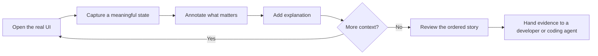
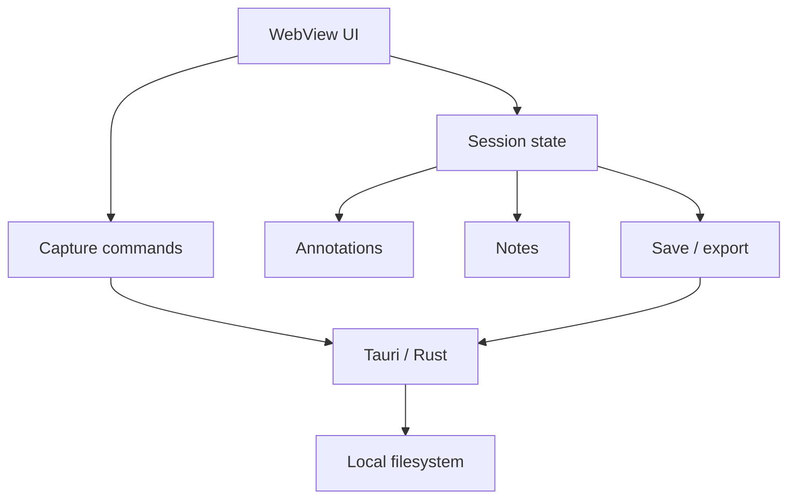

<p align="center">
  
</p>

<div align="center">

# CritIQ

### Capture the story of a UI, not just a screenshot.

**A local-first desktop tool for user-directed UI evidence in AI-assisted software development.**


[](LICENSE)

**[Vision](#why-critiq-exists)** · **[Architecture](#architecture)** · **[Documentation](docs/README.md)** · **[Governance](GOVERNANCE.md)** · **[Contributing](CONTRIBUTING.md)** · **[Security](SECURITY.md)** · **[Support](SUPPORT.md)**

</div>

---

> [!IMPORTANT]
> **Development status:** the default branch is a pre-release implementation. A complete local desktop release candidate is being validated in [PR #8](https://github.com/MythologIQ-Labs-LLC/CritIQ/pull/8). This README intentionally distinguishes current `main` from release-candidate claims so repository documentation does not outrun the code it describes.

## Why CritIQ exists

AI-assisted UI work has an evidence problem.

A single screenshot lacks sequence. A folder full of screenshots loses narrative. A design file describes intended state rather than necessarily showing what the application actually rendered. Giving a coding agent full browser control can also transfer evidence selection away from the person who knows what matters.

CritIQ takes a different position:

> **The user chooses the evidence. CritIQ preserves the story.**

The intended workflow is simple:



CritIQ is not meant to replace the user with autonomous browsing. It exists to make **user-directed runtime evidence** easier to capture, preserve, and communicate.

## Current repository state

`main` contains the Tauri 2 desktop implementation and the core capture, markup, notes, session, and export foundations. It is not currently presented as a final supported release.

The active release-candidate work in PR #8 completes and validates the fuller storyboard contract, including stronger frame isolation, structured annotations, deterministic export, installer publishing, and complete desktop acceptance documentation.

This separation is deliberate:

```text
main              = current pre-release source of record
release candidate = proposed complete local product state
final release     = release candidate + successful desktop acceptance
```

## Architecture

CritIQ uses a deliberately small desktop stack:

```text
Tauri 2 desktop shell
+ Rust native capture/filesystem boundary
+ vanilla JavaScript ES modules
+ local-first output
```



The project does not require an application server, cloud account, cloud synchronization, autonomous browser control, or embedded AI inference.

See [`docs/ARCHITECTURE_PLAN.md`](docs/ARCHITECTURE_PLAN.md) and [`docs/adr/README.md`](docs/adr/README.md).

## Product boundary

CritIQ is intentionally focused on screenshot/storyboard evidence. The following are not ordinary feature additions:

- autonomous browser navigation;
- cloud accounts or synchronization;
- collaborative editing;
- OCR;
- video recording;
- embedded AI inference;
- issue-tracker integration;
- Figma/design-system integration;
- plugin loading.

Expanding into one of those areas requires an explicit product-direction decision under [`GOVERNANCE.md`](GOVERNANCE.md).

## Trust and privacy model

Screenshots can contain credentials, customer information, internal product data, or other sensitive content. CritIQ is local-first specifically to avoid unnecessary external data movement.

Local-first does not mean risk-free. Users remain responsible for what they capture and share, and contributors must use synthetic material for public fixtures and bug evidence.

See [`SECURITY.md`](SECURITY.md).

## Repository map

```text
CritIQ/
├── .github/               # ownership, issue, and PR governance
├── dist/                  # WebView frontend
├── docs/
│   ├── adr/               # architecture decisions
│   ├── ARCHITECTURE_PLAN.md
│   ├── CONCEPT.md
│   └── README.md          # documentation index
├── src-tauri/             # Rust/Tauri backend
├── tests/                 # repository tests
├── CODE_OF_CONDUCT.md
├── CONTRIBUTING.md
├── GOVERNANCE.md
├── SECURITY.md
├── SUPPORT.md
├── LICENSE
└── README.md
```

## Development

### Requirements

- Windows with Tauri 2 prerequisites;
- Node.js 22 or compatible current LTS;
- npm;
- Rust stable toolchain.

### Run locally

```bash
npm ci
npm run dev
```

### Validate

Use the tests and build commands appropriate to the current branch. Release-candidate validation is documented and enforced in PR #8 rather than being retroactively claimed for older `main` commits.

## Governance

CritIQ is stewarded by **MythologIQ Labs LLC**. The current maintainer and product owner is **Kevin R. Knapp** (`@Knapp-Kevin`).

Repository governance defines:

- product-boundary authority;
- editorial, implementation, contract, and security/release change classes;
- AI-assisted contribution authority;
- proof and evidence boundaries;
- merge expectations;
- release authority;
- documentation truth requirements.

Read [`GOVERNANCE.md`](GOVERNANCE.md).

## Contributing

Contributions are welcome when they improve CritIQ clearly and preserve its product boundary.

Start with:

1. [`CONTRIBUTING.md`](CONTRIBUTING.md)
2. [`docs/README.md`](docs/README.md)
3. [`GOVERNANCE.md`](GOVERNANCE.md)
4. [`SECURITY.md`](SECURITY.md) for security-sensitive work

## Documentation

The canonical documentation index is [`docs/README.md`](docs/README.md). Historical governance/evidence records are explicitly separated from active product authority so an old audit cannot accidentally become architecture by archaeological discovery.

## License

CritIQ is licensed under the [MIT License](LICENSE).

## Stewardship

**CritIQ is a MythologIQ Labs LLC project.**

Canonical repository: `MythologIQ-Labs-LLC/CritIQ`

Maintainer: `@Knapp-Kevin`
