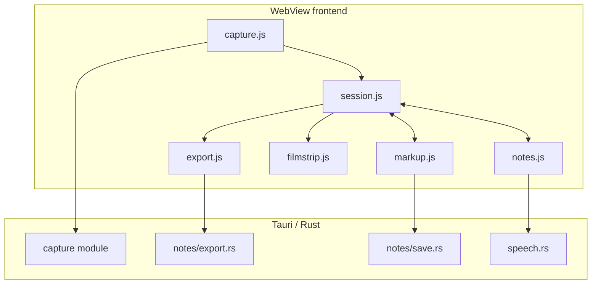

# CritIQ

> Capture the story of a UI, not just a screenshot.

CritIQ is a lightweight desktop storyboard capture tool for AI-assisted UI development. It lets a user navigate a real interface, capture successive states, annotate each frame, attach notes, and export the ordered session as an agent-ready evidence bundle.

The user controls what becomes evidence. The coding agent receives the whole story at once.

## Mission

**CritIQ turns a live UI walkthrough into a precise, ordered, annotated snapshot of actual application state that a developer or coding agent can act on without repeatedly asking for screenshots or taking over the browser.**

CritIQ exists to close a specific gap in AI-assisted UI work:

- A single screenshot lacks sequence and context.
- A pile of screenshots is laborious to create, organize, and explain.
- Giving an agent browser control removes much of the user's control over what gets observed and emphasized.
- Design tools describe intended state, but the handoff from design to the running application is rarely one-to-one.

CritIQ captures the runtime truth while preserving human authorship of the narrative.

## Core workflow


A CritIQ session is an ordered storyboard. Each frame contains the captured UI state, annotations, notes, timestamp, and capture metadata. The export preserves that order so the recipient can understand both individual defects and the flow between them.

## What CritIQ is

- A user-directed screenshot and region capture application.
- A lightweight annotation surface for arrows, rectangles, pen marks, and text.
- A sequential filmstrip for building a UI story across multiple states.
- A note-taking surface with text and speech-to-text support.
- An export tool for producing AI-readable evidence from the session.

## What CritIQ is not

- A general-purpose image editor.
- A screen recording or video editing suite.
- A browser automation agent.
- A design-system replacement.
- A Figma-style design handoff tool.
- A cloud collaboration platform.
- An AI coding agent itself.

Those are all excellent ways to turn a one-day utility into a six-month platform, which is precisely why they are out of scope.

## Current implementation

CritIQ already has the majority of the intended interaction model:

- Tauri 2 desktop shell with a Rust backend and vanilla JavaScript frontend.
- Full-screen, multi-screen, and region capture.
- Ordered capture sessions with filmstrip navigation.
- Per-frame markup tools.
- Per-frame text notes and speech-to-text support.
- Individual, Markdown, and session export paths.

The remaining work is primarily about **storyboard integrity**, not adding a new product surface. The exported session must preserve the annotated state of every frame and package the story in a deterministic, portable form.

## One-day completion target

CritIQ is complete for its intended scope when a user can:

1. Start a session.
2. Navigate through a real application and capture at least three meaningful UI states.
3. Annotate and comment on each frame.
4. Move between frames without losing annotations or notes.
5. Export one portable storyboard bundle containing:
   - numbered annotated PNG frames;
   - a human-readable `storyboard.md`;
   - an agent-readable `manifest.json`;
   - stable frame ordering and metadata.
6. Hand that bundle to a developer or coding agent without additional explanation being required to understand the sequence.

The implementation plan is documented in [`docs/ONE_DAY_EVOLUTION.md`](docs/ONE_DAY_EVOLUTION.md).

## Architecture



The architecture intentionally stays boring. There is no application server, database, account system, or cloud dependency in the core workflow.

## Development

### Prerequisites

- Node.js and npm
- Rust toolchain
- Tauri 2 platform prerequisites for your operating system

### Run locally

```bash
npm install
npm run dev
```

### Validate

```bash
npm test
cd src-tauri && cargo check
```

### Build

```bash
npm run build
```

## License

MIT. See [`LICENSE`](LICENSE).
