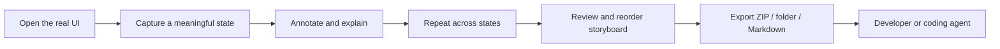

# CritIQ

> Capture the story of a UI, not just a screenshot.

CritIQ is a local-first desktop storyboard capture tool for AI-assisted UI development. A user walks through a real interface, captures meaningful runtime states, annotates them, adds frame or annotation-specific notes, orders the frames, and exports the whole walkthrough as one portable evidence bundle.

The user controls what becomes evidence. A developer or coding agent receives the complete sequence, flattened visual evidence, structured annotations, notes, and capture metadata.

## Complete local product workflow



CritIQ is deliberately not a browser automation agent. It records the states the user chooses to show rather than autonomously deciding what to inspect.

## Feature set

### Capture

- primary or selected screen capture
- all-screen capture
- quick primary-screen region capture
- region selection across the captured desktop
- 0, 2, or 5 second capture delay
- capture metadata for dimensions, timestamp, mode, screen, and region

### Storyboard

- multiple ordered frames in one session
- frame-local annotations and notes
- thumbnail filmstrip
- delete frames
- move frames left or right to change the authoritative sequence
- start a fresh session without restarting the application

### Annotation

- Select and move
- Pen
- Arrow
- Line
- Rectangle
- Ellipse
- Text
- color picker
- stroke/text size
- undo
- delete selected annotation
- clear annotations

Annotations are stored as structured vector data for evidence export and flattened into the exported frame image for universal viewing.

### Viewer

- zoom in/out
- reset view
- pan mode
- middle-button pan
- Ctrl/Cmd + mouse wheel zoom

### Notes

- frame-level text notes
- optional Web Speech transcription when supported by the platform WebView
- notes can be linked to the currently selected annotation
- deleting an annotation safely converts linked notes back to frame notes

### Save and export

**Save Frame** writes the active annotated frame as a full-resolution PNG plus a JSON sidecar to the user's Pictures/CritIQ/Saved directory.

Storyboard export supports:

- ZIP, recommended
- unpacked storyboard folder
- Markdown entry point
- PNG frames, lossless
- JPEG frames with selectable quality
- frame resizing to 100%, 75%, or 50% for smaller handoffs

The canonical storyboard bundle contains:

```text
critiq-session-<id>.zip
├── storyboard.md
├── manifest.json
└── frames/
    ├── 001.png
    ├── 002.png
    └── 003.png
```

JPEG export uses `.jpg` frame names instead.

`manifest.json` uses `critiq.storyboard/v1` and preserves ordered frame IDs, notes, annotation links, vector annotation data, capture metadata, and image paths.

## Keyboard shortcuts

| Shortcut | Action |
|---|---|
| V | Select |
| P | Pen |
| A | Arrow |
| L | Line |
| R | Rectangle |
| E | Ellipse |
| T | Text |
| Delete / Backspace | Delete selected annotation |
| Ctrl/Cmd + Z | Undo |
| Ctrl/Cmd + S | Save active frame |
| Ctrl/Cmd + E | Export storyboard |
| Ctrl/Cmd + + / - | Zoom |
| Ctrl/Cmd + 0 | Reset view |

## Architecture

CritIQ uses:

- Tauri 2 for the desktop shell
- Rust for capture, filesystem output, bundle generation, and ZIP packaging
- vanilla JavaScript ES modules in the WebView
- structured vector annotations rendered onto an HTML canvas
- Web Speech only when supported
- local filesystem storage only

There is no application server, account layer, cloud sync, browser automation runtime, or embedded AI inference.

See [docs/ARCHITECTURE_PLAN.md](docs/ARCHITECTURE_PLAN.md) for the implementation contract and [docs/FEATURE_MATRIX.md](docs/FEATURE_MATRIX.md) for the complete product surface.

## Development

### Prerequisites

- Node.js 22 or compatible current LTS
- npm
- Rust stable toolchain
- Tauri 2 platform prerequisites

### Run

```bash
npm ci
npm run dev
```

### Validate

```bash
npm test -- --run
cargo check --locked --manifest-path src-tauri/Cargo.toml
cargo test --locked --manifest-path src-tauri/Cargo.toml
npm run build
```

CI performs the same validation on Windows and publishes the Tauri bundle.

## Product acceptance

Use [docs/ACCEPTANCE_TEST.md](docs/ACCEPTANCE_TEST.md) for the single end-to-end test pass. It exercises capture modes, frame ordering, all annotation tools, annotation-linked notes, zoom/pan, Save Frame, PNG/JPEG export, output resizing, and bundle verification.

A green CI build proves compilation and automated contracts. The desktop acceptance pass proves that the actual interaction model works as a product.

## Non-goals

CritIQ is not:

- a browser automation agent
- a screen recorder or video editor
- a cloud collaboration platform
- a design-system or Figma replacement
- an OCR pipeline
- an embedded AI coding agent
- a plugin platform

## License

MIT. See [LICENSE](LICENSE).
