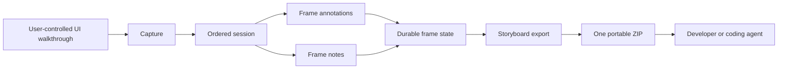
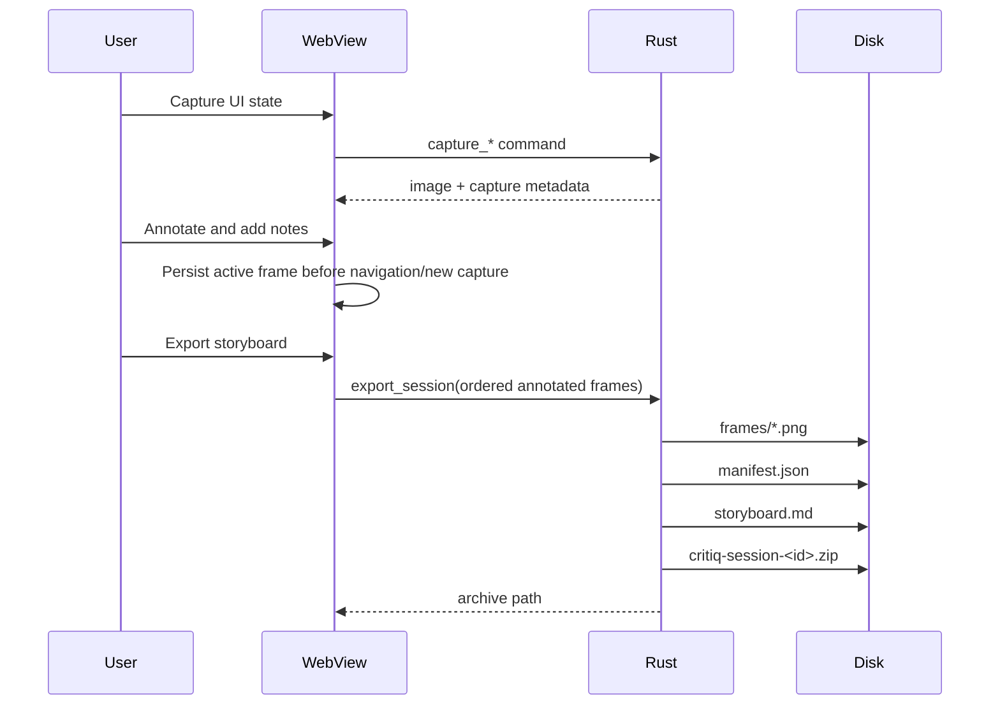

# CritIQ Architecture

## Status

This document describes the active CritIQ v1 architecture. Electron is no longer part of the application or an implementation target.

## Architecture decision

CritIQ is a local-first Tauri 2 desktop application:

- **Desktop shell:** Tauri 2
- **Backend:** Rust
- **Frontend:** vanilla JavaScript ES modules in the WebView
- **Capture:** `screenshots` crate
- **Image processing:** `image` + `base64`
- **Storyboard archive:** `zip`
- **Session state:** in-memory for the active walkthrough
- **Export persistence:** local filesystem only
- **Speech-to-text:** Web Speech API when available in the platform WebView

No application server, account layer, database, browser automation runtime, or embedded AI inference is required.

## System boundary



CritIQ records what the user chooses to show. It does not autonomously navigate or decide what evidence matters.

## Source tree contract

```text
dist/
├── index.html
├── js/
│   ├── app.js
│   ├── capture.js
│   ├── export.js
│   ├── filmstrip.js
│   ├── markup.js
│   ├── notes.js
│   ├── session.js
│   ├── state.js
│   ├── storyboard.js
│   ├── stt.js
│   └── utils.js
└── styles/
    ├── base.css
    ├── buttons.css
    ├── filmstrip.css
    ├── forms.css
    ├── layout.css
    ├── modals.css
    └── overlays.css

src-tauri/
├── src/
│   ├── main.rs
│   ├── capture/
│   │   ├── mod.rs
│   │   ├── multi.rs
│   │   └── util.rs
│   └── notes/
│       ├── archive.rs
│       ├── bundle.rs
│       ├── export.rs
│       ├── mod.rs
│       ├── save.rs
│       ├── types.rs
│       └── util.rs
├── capabilities/
│   └── default.json
├── Cargo.toml
└── tauri.conf.json

tests/
└── storyboard.test.js
```

## Frontend responsibilities

### `capture.js`

Owns user-triggered screen and region capture and calls the Rust capture commands. Before a new frame is appended, it persists the currently active frame.

### `session.js`

Owns the ordered frame collection and active frame. Before navigation or export it persists:

- frame-local notes;
- capture metadata;
- annotation canvas state;
- the composited annotated PNG used for export.

Frame switching must never move markup or notes between frames.

### `markup.js`

Owns the annotation canvas and compositing of the untouched capture with visible markup.

### `notes.js` and `stt.js`

Own frame-local note entry. `stt.js` uses Web Speech only when supported by the host WebView. There is no native Rust speech engine in v1.

### `storyboard.js`

Shapes the ordered frontend session into the narrow export contract. The annotated composite is preferred over the original screenshot.

### `export.js`

Persists the active frame, shapes all frames, and invokes the Rust export boundary. It does not silently fall back to incomplete browser-only exports.

## Rust responsibilities

### `capture/`

Provides Tauri commands for available screens, individual screen capture, multi-screen capture, and region capture.

### `notes/save.rs`

Saves a single annotated image and its associated context.

### `notes/export.rs`

Owns the export command boundary. It:

1. validates the requested export format;
2. sanitizes the session ID before using it in filesystem paths;
3. creates a clean export staging directory;
4. delegates deterministic bundle creation;
5. delegates ZIP creation when requested;
6. removes staging files after a successful ZIP so the recommended path produces one handoff artifact.

### `notes/bundle.rs`

Writes the canonical storyboard contents:

```text
storyboard.md
manifest.json
frames/001.png
frames/002.png
...
```

### `notes/archive.rs`

Packages the canonical contents into a ZIP with deterministic entry names.

## Storyboard data contract

Each exported frame has this logical shape:

```text
Frame
├── sequence
├── stable id
├── timestamp
├── annotated image path
├── notes[]
└── metadata
```

`manifest.json` uses schema identifier:

```text
critiq.storyboard/v1
```

The ordered frame array is authoritative for sequence. The image is authoritative for visual state.

## Data flow



## Security and trust boundaries

- Session IDs are treated as untrusted filesystem input and sanitized before path construction.
- The application does not require shell permissions.
- The application does not expose a native speech command surface.
- Export remains local to the user's filesystem.
- CritIQ does not send captured UI state to an external service as part of the core workflow.

## Dependency policy

Dependencies should remain minimal and task-specific. A dependency is justified only when replacing it would require fragile platform-specific or format-specific code.

Current backend dependency roles:

| Dependency | Purpose |
|---|---|
| `tauri` | Desktop runtime and command bridge |
| `screenshots` | Cross-platform capture |
| `image` | Image handling |
| `base64` | WebView/Rust image transfer |
| `serde` / `serde_json` | Export contracts |
| `dirs` | User Pictures directory resolution |
| `zip` | Portable storyboard archive |

The frontend intentionally has no application framework dependency.

## Validation contract

A change is not considered complete merely because it compiles. Automated validation must cover:

- frontend unit tests;
- `cargo check`;
- Rust unit tests;
- Windows Tauri production build.

The v1 product acceptance test additionally requires a real desktop walkthrough:

1. capture at least three distinct frames;
2. annotate and note each independently;
3. navigate among them repeatedly without state loss;
4. export a ZIP;
5. unpack it outside CritIQ;
6. verify frame images, notes, metadata, and order match what the user reviewed.

## Non-goals

The v1 architecture does not include browser automation, cloud sync, accounts, collaborative editing, design-system integration, OCR, video recording, plugin loading, or embedded AI inference.
