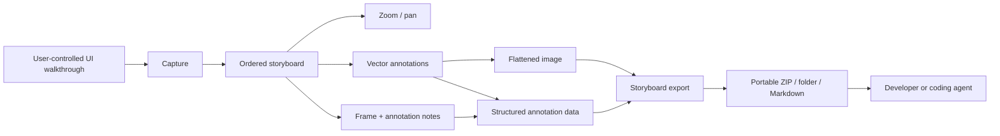

# CritIQ Architecture

## Status

This document describes the active complete local CritIQ architecture. Electron is not part of the application or an implementation target.

## Architecture decision

CritIQ is a local-first Tauri 2 desktop application:

- **Desktop shell:** Tauri 2
- **Backend:** Rust
- **Frontend:** vanilla JavaScript ES modules in the WebView
- **Capture:** `screenshots` crate
- **Image processing:** HTML canvas for composition and format conversion
- **Storyboard archive:** `zip`
- **Session state:** in-memory ordered storyboard
- **Annotation state:** structured vectors per frame
- **Export persistence:** local filesystem
- **Speech-to-text:** Web Speech API when available in the platform WebView

No application server, account layer, database, browser automation runtime, OCR service, or embedded AI inference is required.

## System boundary



CritIQ records what the user chooses to show. It does not autonomously navigate or decide what evidence matters.

## Source tree contract

```text
dist/
├── index.html
├── js/
│   ├── annotation-renderer.js
│   ├── annotations.js
│   ├── app.js
│   ├── capture.js
│   ├── export.js
│   ├── filmstrip.js
│   ├── markup-history.js
│   ├── markup-preview.js
│   ├── markup.js
│   ├── notes.js
│   ├── session.js
│   ├── state.js
│   ├── storyboard.js
│   ├── stt.js
│   ├── text-annotation.js
│   ├── utils.js
│   └── viewer.js
└── styles/
    ├── base.css
    ├── buttons.css
    ├── filmstrip.css
    ├── forms.css
    ├── layout.css
    ├── modals.css
    ├── overlays.css
    └── viewer.css

src-tauri/
├── src/
│   ├── main.rs
│   ├── capture/
│   └── notes/
│       ├── archive.rs
│       ├── bundle.rs
│       ├── export.rs
│       ├── save.rs
│       ├── types.rs
│       └── util.rs
├── capabilities/default.json
├── Cargo.toml
└── tauri.conf.json

tests/
├── annotations.test.js
└── storyboard.test.js
```

## Frontend responsibilities

### Capture

`capture.js` owns screen and region capture. Before a new frame is appended it persists the active frame, so capturing another state cannot discard current annotations or notes.

### Session and ordering

`session.js` owns the ordered frame collection and active frame. A frame persists:

- original capture;
- flattened annotated composite;
- notes;
- structured annotations;
- capture metadata;
- thumbnail;
- timestamp and stable ID.

`filmstrip.js` owns navigation, deletion, and explicit left/right sequence changes.

### Annotation model

`annotations.js` is a pure vector model. It provides cloning, bounds, hit-testing, movement, draft updates, and minimum-validity checks.

Supported annotation types are:

```text
pen     -> points[]
arrow   -> x1,y1,x2,y2
line    -> x1,y1,x2,y2
rect    -> x1,y1,x2,y2
ellipse -> x1,y1,x2,y2
text    -> x,y,text,fontSize
```

Every annotation also carries a stable ID, color, and size.

`annotation-renderer.js` renders those vectors to the visible markup canvas and separately flattens them with the base screenshot for Save/export. Selection indicators are never included in the flattened evidence image.

`markup.js` owns pointer interaction, selection, movement, delete, clear, and orchestration. `markup-preview.js` owns preview/canvas mounting and editor visibility.

`markup-history.js` stores annotation snapshots for undo.

### Viewer

`viewer.js` owns zoom and pan. View transforms never mutate capture pixels or annotation geometry.

### Notes

`notes.js` owns text notes and note rendering. If an annotation is selected when a note is submitted, the note stores that annotation's stable ID as `annotationId`.

Deleting an annotation removes that link but preserves the note as a frame note.

`stt.js` uses Web Speech only when supported. There is no native speech command surface.

### Save and export

`export.js`:

1. saves the active flattened image as a full-resolution PNG plus JSON sidecar;
2. persists the active frame before storyboard export;
3. converts flattened frame images to PNG/JPEG and resizes them in the WebView when requested;
4. shapes the ordered session through `storyboard.js`;
5. calls the Rust filesystem/export boundary.

## Rust responsibilities

### Capture

`capture/` provides commands for screen enumeration, selected-screen capture, multi-screen capture, and fast captures used by region selection.

### Save Frame

`notes/save.rs`:

- defaults empty output requests to `Pictures/CritIQ/Saved`;
- validates explicit output paths against the Pictures directory;
- infers PNG/JPEG extension from the data URL;
- preserves Save Frame at full capture resolution while storyboard export can use 100%, 75%, or 50% frame size;
- writes the flattened image;
- writes a JSON sidecar containing notes, structured annotations, metadata, timestamp, and image filename.

### Storyboard export

`notes/export.rs` validates export mode, sanitizes session IDs, creates a clean staging directory, delegates bundle creation, and delegates ZIP creation.

`notes/bundle.rs` writes the canonical contents:

```text
storyboard.md
manifest.json
frames/001.png
frames/002.png
...
```

JPEG exports use `.jpg` entries instead.

`notes/archive.rs` packages the canonical contents into a deterministic ZIP entry order.

## Storyboard data contract

`manifest.json` uses:

```text
critiq.storyboard/v1
```

Each frame has this logical shape:

```text
Frame
├── sequence
├── stable id
├── timestamp
├── image path
├── notes[]
│   └── optional annotationId
├── annotations[]
└── metadata
```

The ordered frame array is authoritative for sequence. The flattened image is authoritative for what the user visually reviewed. Structured annotations provide machine-readable geometry and relationships.

## Security and trust boundaries

- Session IDs are sanitized before filesystem path construction.
- Explicit Save paths are restricted to the user's Pictures directory.
- The application does not require shell permissions.
- The application does not expose a native speech command.
- Capture and export are local operations.
- No captured UI state is sent to an external service by the core product.

## Validation contract

Automated validation must cover:

- frontend annotation-model tests;
- frontend storyboard-contract tests;
- `cargo check --locked`;
- Rust unit tests;
- Windows Tauri production build;
- a check that building does not mutate `Cargo.lock`.

Automated validation is necessary but not sufficient. The release-candidate interaction outcome is defined in `ACCEPTANCE_TEST.md`.

## Non-goals

Browser automation, cloud sync, accounts, collaborative editing, OCR, video recording, design-system integration, plugin loading, and embedded AI inference are outside the current product boundary.
