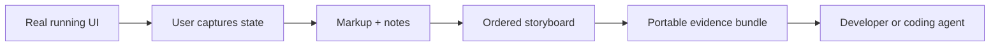

# CritIQ Concept

## Mission

CritIQ turns a user-directed walkthrough of a real interface into a precise, ordered, annotated snapshot of actual application state that a developer or coding agent can act on without repeatedly asking for screenshots or taking over the browser.

## The problem

UI feedback loses fidelity in predictable ways:

- One screenshot captures appearance but not sequence or interaction context.
- Multiple screenshots require repetitive capture, naming, organization, and explanation.
- Browser-control agents decide what to inspect and can miss the user's intended story.
- Design handoffs describe intended state, while implementation work often needs evidence from the application that is actually running.

CritIQ preserves runtime truth while keeping the user in control of what becomes evidence.

## Product model

A CritIQ session is an ordered storyboard of captured UI states. Each frame can carry visible markup, notes, timestamps, and capture metadata. The session is exported as a portable evidence bundle for a human developer or coding agent.

## Product principles

1. **User-authored evidence**: the user decides what matters and in what order.
2. **Actual state over inferred state**: capture the running implementation, not a reconstruction of it.
3. **Sequence matters**: preserve the relationship between UI states, not merely a collection of images.
4. **Portable by default**: the recipient should not need CritIQ installed to understand the exported storyboard.
5. **Small on purpose**: CritIQ captures and communicates UI evidence. It does not become the developer, browser agent, design tool, or collaboration platform.

## Vibe

- Intuitive
- Visual
- Precise

## Anti-goals

CritIQ is not:

- a general-purpose image editor;
- a screen recording or video editing suite;
- an autonomous browser-control system;
- a design-system or Figma replacement;
- an AI coding agent;
- a cloud collaboration service.

## v1 destination

A user can capture several meaningful UI states, annotate and comment on each one, review them as an ordered filmstrip, and export one self-contained storyboard bundle that preserves the annotated frames, notes, metadata, and sequence.

See [`ONE_DAY_EVOLUTION.md`](ONE_DAY_EVOLUTION.md) for the bounded completion plan.
