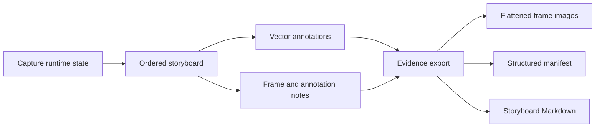

# CritIQ Documentation

This index separates **current product authority** from historical evidence. That distinction is deliberate: old planning records can remain useful without being allowed to impersonate the present architecture.

## Start here

| Need | Read |
|---|---|
| Understand CritIQ quickly | [`../README.md`](../README.md) |
| Understand product intent | [`CONCEPT.md`](CONCEPT.md) |
| Check implemented features | [`FEATURE_MATRIX.md`](FEATURE_MATRIX.md) |
| Understand architecture | [`ARCHITECTURE_PLAN.md`](ARCHITECTURE_PLAN.md) |
| Review architecture decisions | [`adr/README.md`](adr/README.md) |
| Run the complete desktop acceptance pass | [`ACCEPTANCE_TEST.md`](ACCEPTANCE_TEST.md) |
| Check current blockers | [`BACKLOG.md`](BACKLOG.md) |
| Review repository governance | [`../GOVERNANCE.md`](../GOVERNANCE.md) |
| Contribute | [`../CONTRIBUTING.md`](../CONTRIBUTING.md) |
| Report security issues | [`../SECURITY.md`](../SECURITY.md) |
| Get support | [`../SUPPORT.md`](../SUPPORT.md) |

## Current product authority

### Product

- [`CONCEPT.md`](CONCEPT.md) - mission, user problem, product boundary, and interaction model.
- [`FEATURE_MATRIX.md`](FEATURE_MATRIX.md) - authoritative feature-status checklist.
- [`BACKLOG.md`](BACKLOG.md) - live blockers and future product-direction decisions.

### Architecture

- [`ARCHITECTURE_PLAN.md`](ARCHITECTURE_PLAN.md) - current Tauri 2, Rust, and WebView implementation contract.
- [`adr/README.md`](adr/README.md) - canonical architecture-decision index.
- [`adr/ADR-001-tauri-local-first-desktop.md`](adr/ADR-001-tauri-local-first-desktop.md) - desktop architecture and local-first boundary.
- [`adr/ADR-002-user-directed-evidence.md`](adr/ADR-002-user-directed-evidence.md) - user-controlled evidence selection rather than autonomous navigation.
- [`adr/ADR-003-storyboard-evidence-contract.md`](adr/ADR-003-storyboard-evidence-contract.md) - portable evidence bundle and manifest contract.

### Validation and release

- [`ACCEPTANCE_TEST.md`](ACCEPTANCE_TEST.md) - complete desktop release-candidate acceptance procedure.
- [`ONE_DAY_EVOLUTION.md`](ONE_DAY_EVOLUTION.md) - bounded v1 implementation and completion record.

### Repository governance

- [`../GOVERNANCE.md`](../GOVERNANCE.md) - authority, change classes, evidence boundaries, and release policy.
- [`../CONTRIBUTING.md`](../CONTRIBUTING.md) - contribution workflow and engineering expectations.
- [`../SECURITY.md`](../SECURITY.md) - vulnerability reporting and security boundary.
- [`../SUPPORT.md`](../SUPPORT.md) - user and contributor support routing.
- [`../CODE_OF_CONDUCT.md`](../CODE_OF_CONDUCT.md) - participation expectations.

## Architecture at a glance

## Historical governance and evidence records

The following files are preserved as historical evidence. They are **not** current architecture authority:

- `SYSTEM_STATE.md`
- `META_LEDGER.md`
- `SHADOW_GENOME.md`
- `SUBSTANTIATION_REPORT.md`
- `SUBSTANTIATION_FAILURE.md`
- `BOOTSTRAP_REPORT.md`
- `Planning/plan-razor-remediation.md`

Some sealed records describe the March 2026 repository state and mention dependencies or implementation paths that have since been removed. They remain audit history, not active implementation guidance.

## Documentation truth rule

If active code and active documentation disagree, the discrepancy is a defect.

Fix the documentation or the implementation as part of the same change. Do not preserve contradictory active guidance for historical sentimentality. Git already remembers the past quite adequately.